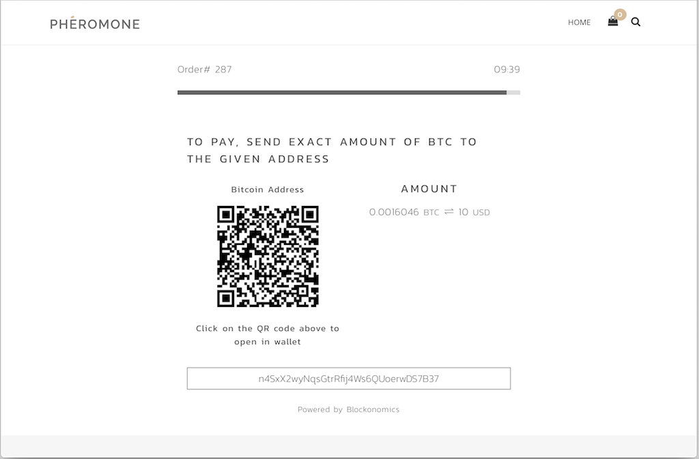

# Bitcoin Easy Digital Downloads - Blockonomics # 
**Tags:** bitcoin, accept bitcoin, easy digital downloads, edd, bitcoin payments 
**Requires at least:** 3.0.1 
**Tested up to:** 4.9.8 
**Stable tag:** 1.0
**License:** MIT 
**License URI:** http://opensource.org/licenses/MIT 

Accept bitcoin payments and altcoins on your Easy Digital Downloads website. Bitcoin payments go directly to your wallet. 

## Description ## 

The fastest and easiest way to start accepting Bitcoin payments on your Woocommerce online store. Since 2015, [Blockonomics](https://www.blockonomics.co/merchants?utm_source=wordpress) has helped thousands of ecommerce sites increase sales by including Bitcoin, Ethereum and Litecoin as payment option for their customers. 

## Installation ## 

### Tutorials ### 
- [Video Tutorial](https://www.youtube.com/watch?v=ZL8pM_yqmaU) 
- [Blog Tutorial](https://blog.blockonomics.co/how-to-accept-bitcoin-on-your-edd-wordpress-shop-3d26df31901d) 
- For quick help, ping us on [Telegram Channel](https://t.me/BlockonomicsCo) 

### Setup Instructions ### 
- Navigate to Downloads -> Settings -> Payment Gateways -> General
- Select Blockonomics in Payment Gateways section.
- Navigate to Downloads -> Settings -> Payment Gateways -> Blockonomics'
- Click on **Get Started for Free** on [Blockonomics > Merchants](https://www.blockonomics.co/merchants) and complete the wizard to get your API Key
- Enter your API Key and Save Changes
- Click on Test Setup to verify installation
	
Try checkout product , and you will see pay with bitcoin option. 
Use bitcoin to pay and enjoy ! 

## Screenshots ## 

* Blockonomics Settings
 

* Invoice.
 
