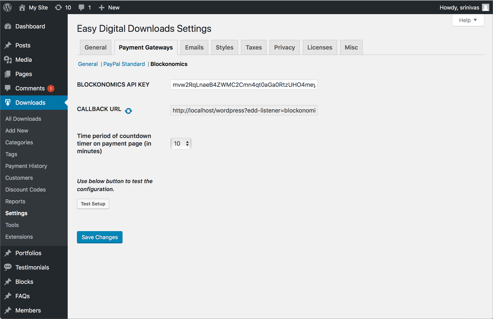

# easy-digital-downloads-plugin
  * Blockonomics plugin for Easy Digital Downloads plugin v2.6.9
# Requirements
  * WordPress should have 'Easy Digital Downloads' v2.6.9 plugin installed.
# Install 
  * Download latest release package from [Releases](https://github.com/blockonomics/easy-digital-downloads-plugin/releases).
  * Open WordPress admin page.
  * Navigate to 'Plugins' -> 'Add New' -> 'Upload Plugin' and upload the zip file. 
	* Install and Activate the plugin.
# Configuration
  * Navigate to 'Downloads' -> 'Settings' -> 'Payment Gateways' -> 'General'
  	* Select 'Blockonomics' in 'Payment Gateways' section.
  * Navigate to 'Downloads' -> 'Settings' -> 'Payment Gateways' -> 'Blockonomics'
  	* And configure blockonomics plugin and put API_KEY
# Screenshots
  * Payment gateway selection.
  

  * Configuration.
   

  * Invoice.
   
